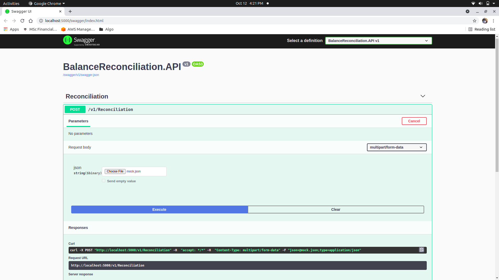
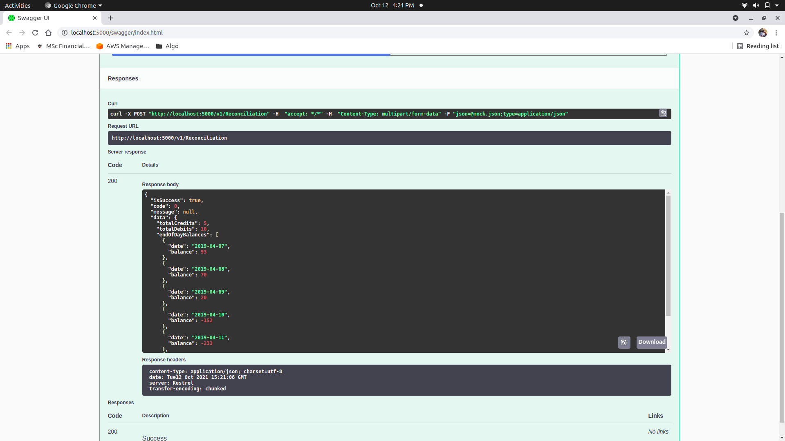
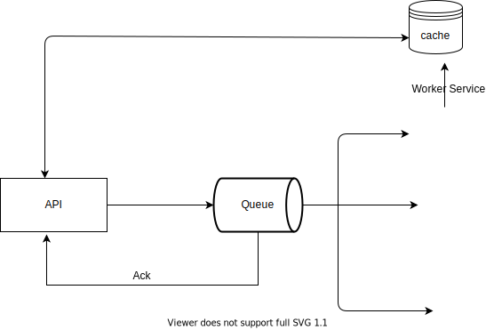

# Implementation of an EOD API
This API calculates EOD - End of day balances of the transactions over a given period  
It is a rolling balance, the closing balance of yesterday is the opening balance of today;  
EOD is the closing balance for the day

EOD is very important in accounting as it helps financial organizations check for consistency.

# How application works

The Reconciliation POST endpoint accepts a json file upload in a agreed template   
deserializes it then calculates the EOD of the transactions in the file.

# Running the application

`docker-compose up`

# Testing
After running the application  

- Open browser  
- Navigate to [http://localhost:5000/swagger](http://localhost:5000/swagger)

# Sample

# Improvement
Considering this task to be CPU intensive, we can move the service project from a class library to a worker service  
Employing a queue to make the EOD calculation process asynchronous.  

Therefore, new architecture will be like 

In the architecture above, we scale out the worker service based on request queueing.

Additional mechanisms will be added seeing this feature is async now.

- Endpoints to get EOD balances/pending status
- Webhook for EOD balances

These above mechanisms will retrieve the EOD from cache by a specified correlationID which was sent as acknowledgement from the queue.